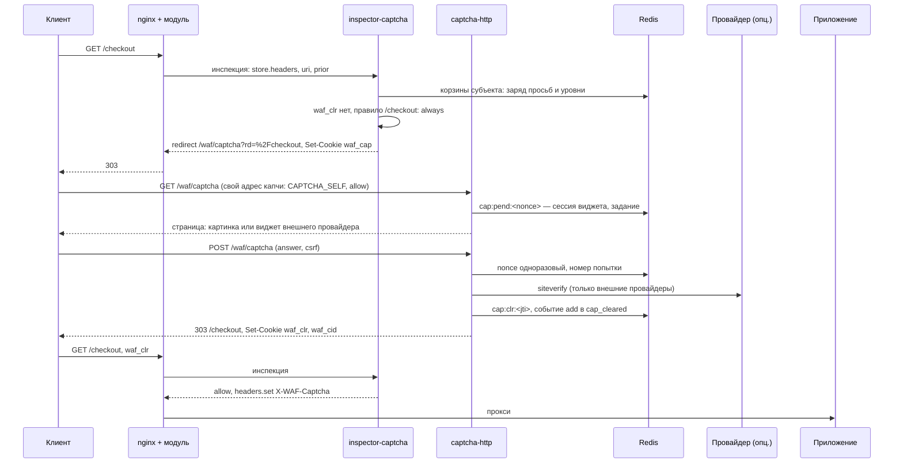

# Капча

> **Статус.** Этапы 1–6 закрыты и проверены на стенде 2026-08-23, этап 7
> (канал действий) — 2026-08-24, этапы 8–9 (корзины вместо репутации и правила
> по событиям) — 2026-08-25; вместе с ними выпилены счёт фазы как триггер и
> провайдер `pow` — [что осталось](#план-разработки).
> Код — [`inspectors/captcha`](../README.md),
> прогон — `sh tests/captcha/captcha.sh`. Контракт модуля, на
> который опираемся, зафиксирован:
> `docs/inspectors.md`,
> `docs/verdict-protocol.md`,
> `docs/deny-pages.md`. Референсная реализация того же
> каркаса — второй фактор (`docs/inspectors/auth/README.md`).
>
> JS-челлендж — **другой** модуль: `docs/inspectors/challenge/README.md`.
> Общего ключа, образа и subject нет.

Инспектор, который решает, пора ли требовать от клиента доказательство, что
он человек, и проверяет предъявленное. Модуль nginx этого не назначает: сервис
смотрит свою cookie, корзины субъекта ([buckets.md](buckets.md)), `prior`,
путь запроса — и отвечает `allow`, `redirect` или `deny`. Чем именно
доказывают человечность — вопрос профиля: своя картинка без внешних
зависимостей и без JS, Turnstile, reCAPTCHA, hCaptcha, SmartCaptcha.

## Что решает этот модуль

Отсекает клиента без действующего клиренса там, где профиль требует
доказательства. Когда требовать — политика профиля; чем доказывать —
провайдер; кто уже доказал — запечатанная cookie `waf_clr`.

```
mode off                                             → allow
mode observe                                         → allow (в аудит would_*; корзины и просьбы живые)
hmac(waf_clr) ок, срок не вышел, привязка совпала,
    jti не отозван, личная корзина ниже captcha_at   → allow + X-WAF-Captcha приложению
правило страницы / профиля: trigger off             → allow
trigger buckets, все корзины ниже captcha_at
    и prior не сработал                              → allow
                         -- нужно доказательство --
метод не в redirect_methods, или html_only
    и Accept без text/html                           → deny  response=captcha_required (403, тело каталога)
иначе                                                → redirect 303 на path?rd=…, Set-Cookie waf_cap
```

Лестница та же, что у auth (`docs/inspectors/auth/README.md`):
редирект на страницу осмыслен только там, где ответ увидит человек в
браузере. `POST`, `fetch` и мобильные клиенты получают 403 с машиночитаемым
телом — и по нему сами решают, показать ли виджет
([«SPA и API»](#spa-и-api-виджет-без-редиректа)).

Две ступени выше капчи — JS и второй фактор — её не вызывают и ею не
вызываются. Порядок на маршруте: `challenge` (умеет ли клиент JS) →
`captcha` (человек ли он) → `auth` (кто он), каждая на своей волне.

## Зачем два контейнера, а не один

Те же два SLO, что у челленджа (`docs/inspectors/challenge/README.md`)
и auth (`docs/inspectors/auth/README.md`):

| | Инспектор | HTTP |
| --- | --- | --- |
| Где живёт | шина, `waf.req.captcha`, queue group | `location /waf/captcha` с `proxy_pass`; капча на нём стоять может -- свой адрес она пропускает |
| Когда зовут | каждый запрос маршрута | только те, кого увели, и SPA-вызовы виджета |
| Бюджет | `timeout=10ms` | сотни миллисекунд: siteverify провайдера, генерация картинки |
| Состояние | ключ, множество отзыва в памяти; корзины — во внутреннем Redis контура | Redis: сессии виджета, ответы картинки, счётчики |
| Падение | политика `waf_deadline` маршрута | новые клиренсы не выдаются, действующие живут |

Один образ `waf-captcha`, два контейнера: `inspector-captcha`, `captcha-http`.
Ключ `waf_captcha_hmac` общий только у этой пары. Провайдера виджета знает
только HTTP: инспектор не ходит ни в Turnstile, ни в Redis за картинкой — он
открывает cookie и смотрит на корзины.

## Что уже решено модулем — не трогаем

Границы те же, что у auth, и следствия те же:

- **Cookie ставится только с `deny` и `redirect`.** Скользящего продления
  клиренса нет. Срок абсолютный; истёк — виджет заново. Отсюда `clearance.ttl`
  в часах, а не минутах.
- **Заголовок запроса снять нельзя, только перезаписать.** `X-WAF-Captcha`
  выставляется на каждом `allow` целиком, включая значение `none`, — иначе
  клиент подставит своё.
- **Заголовки едут локатором `store.headers`.** Маршрут обязан снимать
  заголовки и не маскировать `cookie`; `args` — ради строки запроса адреса
  возврата. Один `GET` в Redis на запрос — цена инспектора, заложенная в
  `timeout=10ms`.
- **Цель редиректа — только `/waf/captcha…`**, даже если в
  `waf_redirect_allow` маршрута есть `/waf/js` и `/waf/login`. `rd=` — только
  локальный путь, проверяют и инспектор, и HTTP.
- **HTML с шины не принимается**, страницу отдаёт только HTTP. Код отказа —
  имя из каталога `waf_deny_response`; `captcha_required` и `too_many` обязаны
  быть в нём объявлены.
- **Два `redirect` в одной волне — гонка.** Капча стоит на волне после
  `challenge` и до `auth`.

## Поток



Второй запрос — не навигационный:

```
POST /api/cart без waf_clr при trigger always → deny captcha_required → 403 + тело каталога
фронтенд читает тело, зовёт /waf/captcha/api, показывает виджет, POST /waf/captcha/verify
→ Set-Cookie waf_clr, повтор исходного запроса
```

## Конфигурация nginx

```nginx
waf_inspector captcha        subject=waf.req.captcha;
waf_inspector captcha-login  subject=waf.req.captcha profile=login;

waf_deny_response captcha_required status=403 body=/etc/nginx/waf/captcha_required.json;
waf_deny_response too_many         status=429;
waf_redirect_allow /waf/captcha;

server {
    location / {
        waf_capture  request headers args;
        waf_inspect  request challenge wave=2 timeout=10ms;   # необязателен
        waf_inspect  request captcha   wave=3 timeout=10ms;
        proxy_pass http://app;
    }

    location = /login {
        waf_capture  request headers args;
        waf_inspect  request captcha-login wave=3 timeout=10ms;
        proxy_pass http://app;
    }

    # Страница, API виджета и verify. Рекурсию («капча требует капчу») создают
    # инспекторы, а не модуль: снимаем инспекторов, а модуль оставляем включённым
    # ради локального слоя -- забаненный адрес не должен молотить по генерации
    # картинок. Снятое снятие тянет за собой превью и архив: без них nginx -t
    # откажет («preview wider than capture», «archive needs inspectors»).
    location /waf/captcha {
        waf on;
        waf_inspect  request none;
        waf_inspect  response none;
        waf_capture  request none;
        waf_preview  request none;
        waf_archive  request none;

        waf_local_check cap_ipban $binary_remote_addr action=block response=blocked;
        waf_local_rate  $binary_remote_addr rate=10r/s burst=10 response=too_many;

        proxy_pass http://captcha_http;
    }
}
```

Разные профили на разных маршрутах — **единственный** способ привязать
политику к странице: `/login` всегда, `/` — по корзинам. Один процесс
обслуживает все профили пространства, `route.profile` говорит, какой
применить.

Порядок волн капча по-прежнему уважает: она стоит после `challenge` и до
`auth`, и два `redirect` в одной волне — гонка.

## Отдельный конфиг: профиль

```yaml
# profiles/default/profile.yaml
mode: enforce                 # печатает контроллер; режим вызова -- на маршруте (waf_inspect … mode=)

path: /waf/captcha            # тот самый URI, который настраивает оператор
title: "Подтвердите, что вы не робот"
note: ""

trigger:
  when: buckets               # always | buckets | never
  prior:                      # необязательно: что принимаем от соседей
    - from: "*"
      accept: [challenge]     # просьба любого соседа показать проверку
    - from: action
      accept: ["*"]           # все глаголы: challenge, skip, note
    - from: modsec
      accept: [note]
      codes: [MODSEC_SQLI]

buckets:                      # общий счёт субъектов, см. buckets.md
  ip:        { max: 100,  loss: 1,   captcha_at: 60, ban_at: 90 }
  sess:      { max: 100,  loss: 1,   captcha_at: 60 }
  asn_net:   { max: 300,  loss: 1,   captcha_at: 70 }
  asn_router: { max: 1000, loss: 0.5, captcha_at: 80, ban_at: 95 }

rules:                        # что делать на событиях, см. buckets.md
  - { on: fail,  charge: ip, percent: 20 }     # пять провалов -- корзина полна
  - { on: pass,  charge: ip, percent: -100 }   # прошёл -- обелить адрес
  - { on: pass,  list: cap_cleared, write: cid, ttl: 24h }
  - { on: bucket_ban, bucket: ip, list: cap_banned, write: addr, ttl: 1h }
  # cleared -- клиент предъявил действующий клиренс: человек проверен, и это
  # единственное, чем капча может ослабить соседей.
  - { on: cleared, to: counter, do: note, apply: session, value: -100, counter: scraper }
  - { on: cleared, to: modsec,  do: threshold, delta: -50, code: HUMAN }
  - { on: cleared, to: vlai,    do: off }
  - { on: cleared, do: mark, marker: human verified }
  # uncleared -- клиренса нет, что бы лестница ни решила дальше: им капча
  # включает соседей дальше по цепочке.
  - { on: uncleared, to: rewrite, do: mutate, group: prices, set: on, code: NO_CLEARANCE }
  - { on: uncleared, to: vlai,    do: active }
  # next -- решение лестницы на этом запросе: allow | challenge; пусто -- любое.
  - { on: uncleared, next: challenge, charge: ip, percent: 30 }   # цена показа виджета

gate:
  redirect_methods: [GET, HEAD]
  redirect_status: 303
  deny_response: captcha_required
  html_only: true
  # inline: true -- виджет телом ответа на том же URI вместо редиректа:
  # инспектор выписывает билет, берёт страницу у captcha-http
  # (WAF_CAPTCHA_HTTP_URL), кладёт её в обменник и отвечает deny с секцией rewrite;
  # модуль отдаёт объект телом с кодом deny_response. Записи каталога и
  # прокси-локации не нужны; страница не досталась -- редирект, как без inline.
  inline: false

provider:                     # основной виджет
  kind: image
  length: 5
  audio: true

fallback:                     # запасной: не загрузился / siteverify лёг
  kind: turnstile

provider_config:
  image:
    alphabet: "ABCDEFGHJKLMNPQRSTUVWXYZ23456789"
    languages: [ru, en]
  turnstile:
    sitekey: 0x4AAAAAAA…
    secret_store: 9b1c70aa-0e11-4d2c-9c01-000000000031
    remoteip: true
    timeout: 3s
    on_error: fallback        # fallback | allow | deny
  recaptcha:
    version: v2               # v2 | v3
    sitekey: ""
    secret_store: ""
    min_score: 0.5            # только v3
    remoteip: true
    timeout: 3s
    on_error: fallback
  hcaptcha:
    sitekey: ""
    secret_store: ""
    timeout: 3s
    on_error: fallback
  smartcaptcha:               # Yandex SmartCaptcha
    sitekey: ""
    secret_store: ""
    timeout: 3s
    on_error: fallback

challenge:                    # билет: выдан инспектором, читает HTTP
  cookie: waf_cap
  ttl: 5m

clearance:
  cookie: waf_clr
  id_cookie: waf_cid          # короткий идентификатор для локального слоя
  ttl: 24h
  bind: [subnet, ua]          # subnet | ip | ua; subnet и ip несовместимы
  subnet: { v4: 24, v6: 64 }  # нарезка для bind: subnet; при bind: ip — /32, /128

fingerprint:                  # только страница капчи, см. «Отпечатки клиентов»
  collect: true
  canvas: false
  farm_at: 50                 # клиренсов на один отпечаток за window
  window: 1h

limits:                       # только HTTP: анти-флуд самой страницы
  issue_per_subnet: 30/m      # страниц и заданий на подсеть
  verify_per_subnet: 60/m     # проверок на подсеть
  pending_max: 200000         # живых сессий виджета в Redis
  provider_budget: 50/s       # вызовов siteverify на процесс

upstream:
  header: X-WAF-Captcha       # image | turnstile | … | none

roster:
  store: redis                # redis | memory
  prefix: "cap:"
  revoke_refresh: 2s
```

Профили лежат каталогом, перечитываются по отпечатку. Режима у профиля в
панели нет: включена ли капча и гейтит ли она, решает вызов на маршруте
(`waf_inspect … mode=`); `path` обязателен всегда. Файловый `mode: observe`
загрузчик ещё понимает: он всегда отвечает модулю `allow` — с кодом
`CAPTCHA_OBSERVE` там, где `enforce` выдал бы билет, — и пишет в аудит, что
решил бы (`engine.passive: true`,
`would_verdict`, `would_code`, `trigger`). Корзины, заряды, просьбы соседей и
правила по заполнению (записи в наборы, просьбы соседям) работают как в
`enforce`: глушится только вердикт, общий контракт — в
`docs/inspectors.md`. Это единственный
способ откалибровать пороги корзин на живом трафике, не заперев
пользователей. `path` обязателен только в `enforce`.

**Секции `roster` и `limits` — свойства процесса, а не профиля.** Объявляются
в профиле, потому что там их ищут; расхождение между профилями отвергает
поколение целиком — как у auth.

### Когда требовать: `trigger`

Три источника, любой из которых переводит запрос в ветку «нужно
доказательство»:

| Источник | Что читает инспектор | Зачем |
| --- | --- | --- |
| `when: always` | ничего | формы входа, регистрации, сброса пароля, чекаут |
| `when: buckets` | корзины субъекта против их `captcha_at` | общий случай: виджет тем, кого нагрели соседи |
| `prior[]` | действия ранних волн: `from`, глагол, `code` | точечно: TOR / датацентр по `ip` — прямая просьба соседа, см. ниже |

`when: never` — профиль только проверяет клиренс, но не выдаёт редирект.
Нужен маршрутам, куда клиент приходит уже с `waf_clr`, выданным на другом
маршруте того же хоста, и которые не должны уводить его на виджет ни при
каком заполнении корзин: например, статика SPA.

Дыру «получил клиренс, потом стал ботом» закрывает личная корзина сессии
([buckets.md](buckets.md)): соседи греют её осью `session`, переполнение
делает клиренс недействительным — виджет заново, новая кука. Прежние
`reverify_at`/`reverify_after` умерли вместе со старой репутацией.

### Команды между инспекторами

Инспекторы друг друга не вызывают — это принцип контура. Но у ранней волны
есть два законных способа сказать поздней, что делать, и у них разный
масштаб.

**На запрос: действия в `prior`.** Инспектор прикладывает к своему ответу
адресные просьбы, модуль их переносит, но не исполняет. Форма, словари и
пределы — `docs/inspector-actions.md`; здесь важно
только то, что из этого умеет капча:

| Глагол | Что делает капча |
| --- | --- |
| `challenge` | показать проверку — если её вообще положено показывать здесь: `when: never` просьбу переживает |
| `skip` | не задавать вопрос на этом запросе |
| `note` | изменить корзину: `value` — проценты её ёмкости, плюс пополняет, минус снимает (−100% — обнулить). Ось выбирает корзину: `ip` → адрес, `session` → личная корзина клиренса, `asn` → обе ASN-корзины; `request` корзины не имеет |

`reauth` адресован не нам — правило с ним не грузится. `threshold` капча
больше не принимает: единственная её шкала — корзины, и масштабировать
коэффициентом нечего ([buckets.md](buckets.md)).

`challenge` на клиента с действующим клиренсом виджета не даёт: человек уже
проверен, и просьба получает в аудите исход `cleared`, а не `applied`. Кто
хочет перепроверить человека, шлёт `note` с осью `session` и плюсом: личная
корзина переполняется, клиренс гаснет, и следующий `challenge` исполнится.

**Что капча говорит сама.** Она стоит на волне и отправитель канала наравне
с остальными: правила по событиям (`rules`, [buckets.md](buckets.md)) шлют
просьбы соседям с событий волны — порогов корзин (`bucket_captcha`,
`bucket_ban`) и клиренса: есть он (`cleared`) или нет (`uncleared`). Форма
просьбы общая: просьбы соседям (`challenge`, `threshold`, `skip`, `reauth`,
`note`, `mutate`), режим вызова соседа (`active`, `passive`, `vote`, `off`) и
глаголы записи маршрута (`audit`, `archive`, `mark`, `score`). `cleared` —
единственное положительное, что капча знает о клиенте, и единственное, чем
она может ослабить соседей: снять корзину счётчику, дать скидку modsec, не
звать vlai. `uncleared` — обратное: человек не проверен, и соседям дальше по
цепочке это стоит знать — включить классификатор, замаскировать выдачу,
добавить очков. Оба события — состояние и срабатывают на каждом таком
запросе: просьба канала действует на один запрос, повторять её норма;
повторная запись в набор продлевает срок, заряд ложится снова (`write: cid`
известен только у `cleared`). `uncleared` не смотрит, что лестница решила
дальше, но просьба соседу доедет, только если запрос пойдёт дальше: виджет
обрывает фазу, пока капча не стоит на маршруте в `vote`. Уточнение
`next: allow | challenge` сужает `uncleared` и пороги до решения лестницы на
этом запросе: «пропустила — включить соседей», «показала виджет — взять цену
показа». Провал и прохождение виджета живут в HTTP-процессе, он не на волне,
и просьбам с них не уехать.

Глагол называет намерение, понятное всему контуру, а частности живут в `code`:
`ip` не обязан знать, как у нас устроены пороги, а мы — что именно он называет
датацентром. Ось (`apply`) говорит, о ком высказывание: `request` — только про
этот запрос, `ip` / `asn` / `session` — про субъекта, и во что это превратить,
решаем мы.

Ограничения загрузчика — [profile.go](../internal/config/profile.go):
`from: "*"` годится только для `challenge` — послабление (`skip`, знак
`note`), доступное любому инспектору контура, — способ для
одного скомпрометированного отменить находки всех остальных. Ужесточение
широковещательным быть может: в худшем случае это лишняя капча, и видно её в
первую минуту. Потолков и фильтра осей в правилах больше нет: границы держат
загрузчик отправителя и ёмкость корзины ([buckets.md](buckets.md)).

Правило по чужому числу (`score` из `prior`) не поддерживается
намеренно: это внутренняя шкала соседа без обещания стабильности, а не число из
`nginx.conf`, и правило меняло бы смысл от правки в чужом файле.

**На субъекта: активные списки.** Логаут, бан, отзыв клиренса — это не
свойство запроса, а свойство сессии, и через сообщение на шину они не
передаются: следующий запрос той же сессии придёт без этого `prior`. Для
этого есть наборы локального слоя и множества отзыва, и писать в них может
любой инспектор, который снял заголовки и видит короткие идентификаторы
`waf_sess` и `waf_cid`:

```
инспектор аномалий: add waf_sess → waf.sets.<набор>.event → логаут на всех краях
                    add waf_cid  → waf.sets.cap_banned.event → капча заново (и лимит по cid)
captcha-http:       zadd cap:rev <jti> <exp>             → отзыв клиренса у всех реплик инспектора
```

Идентификаторы короткие и открытые именно ради этого: токены запечатаны и
прочитать из них `sid`/`jti` сосед не может, а `waf_sess`/`waf_cid` — может.
Пакет публикации один на всех -- `dataset` из `placitum-shared`: синхронный режим у HTTP-процессов, фоновый у инспекторов.
форма события — та, что принимает контроллер. Так «команда соседу»
становится записью в список, которую видно в UX и которую можно отменить
руками, а не невидимым RPC между контейнерами.

### Корзины: общий счёт субъектов

Счёт в сообщении модуля живёт один запрос и капче не виден вовсе. Плохого
клиента — безкуковый поток, где каждый запрос безупречен, — ловит единственная
шкала капчи: **корзины субъектов**, общий счёт во внутреннем Redis контура с мгновенной
реакцией и потерями по времени. Четыре корзины (адрес, личная корзина сессии,
анонсированная подсеть, автономная система целиком), у каждой свои пороги
(`captcha_at` — виджет, `ban_at` — событие для правил профиля), наполнение —
только просьбами соседей. Устройство, арифметика хранения, правила по событиям
и форма секции `buckets` — **[buckets.md](buckets.md)**.

### На каких путях стоит капча

Решает маршрут: `waf_inspect … profile=` в том `location`, где проверка нужна.
Секция `pages` профиля умерла (загрузчик читает её одно поколение и
игнорирует) — политика на путях жила в двух местах сразу, и второе было
невидимо из конфигурации nginx.

| Ситуация | Чем решать |
| --- | --- |
| Разные `location` в nginx | разные профили через `waf_inspect … profile=` |
| Один `location /` на SPA, пути — внутри приложения | отдельные `location` под чувствительные пути со своим профилем |
| Путь должен быть публичным | **не объявлять инспектор на нём** — как у auth, список исключений в профиле не замена маршруту |

### Провайдеры

Провайдер — это способ показать задание и проверить ответ. Контракт узкий:

```go
type Provider interface {
    Kind() string
    Issue(ctx, Session) (Challenge, error)          // что показать: картинка, sitekey
    Verify(ctx, Session, Answer, Client) (Result, error)
    Needs() Needs                                   // js: да/нет; внешняя сеть: да/нет
}
```

| Провайдер | Что доказывает | Где считается | JS | Внешняя сеть | Секрет |
| --- | --- | --- | --- | --- | --- |
| `image` | чтение искажённого текста; аудио-вариант | HTTP генерирует, ответ в Redis под nonce | **нет** | нет | нет |
| `turnstile` | вердикт Cloudflare | siteverify из HTTP | да | да | `secret_store` |
| `recaptcha` | вердикт Google, v2 или v3 со `min_score` | siteverify из HTTP | да | да | `secret_store` |
| `hcaptcha` | вердикт hCaptcha | siteverify из HTTP | да | да | `secret_store` |
| `smartcaptcha` | вердикт Yandex | validate из HTTP | да | да | `secret_store` |

**`image` — умолчание и единственный обязательный.** Контур без доступа во
внешнюю сеть, без аккаунта у третьей стороны и без передачи IP клиента наружу
обязан работать из коробки. Он же единственный, кому не нужен JS: маршрут
`html_only` с клиентом без JS (старые браузеры, текстовые, строгие политики)
иначе упирается в тупик. Провайдеры-сервисы подключаются, когда они доступны
и разрешены.

**PoW выпилен** (2026-08-25). Он доказывал вычисление, а не человечность:
ферма арендует счёт дешевле, чем его тратит телефон в кармане пользователя, —
и единственным способом сделать автомат дорогим он был лишь пока не было
общего счётчика. Теперь темп держат корзины: они видят субъекта поперёк
запросов и реплик, чего PoW не умел в принципе. Заодно умер его вход — сырой
счёт фазы: `difficulty_per_score` был последним, кто его читал. Старые
профили с `kind: pow` читаются одно поколение — на его место встаёт свой
запасной или картинка, в лог едет предупреждение.

**Ровно два: `provider` и `fallback`.** Основной виджет показывается
первым; запасной — когда скрипт основного не загрузился, у клиента нет JS или
siteverify недоступен (`on_error: fallback`). Больше двух не бывает: нужен
другой набор на другом пути — другой профиль через `waf_inspect … profile=`. `on_error: allow` — выдать
клиренс без проверки (пометка в токене и аудите `CAPTCHA_PROVIDER_DOWN`);
`on_error: deny` — отказ. Выбор fail-open / fail-closed — свойство профиля,
не процесса: у витрины и у админки он разный.

**Внешний провайдер — это передача IP клиента третьей стороне.** `remoteip:
true` включается осознанно; по умолчанию в документе профиля он выключен, а
UX показывает это рядом с ключом. Секреты — store-объекты, зашифрованные в
браузере ключом контура; открывает их `captcha-http`, инспектор не ходит.

### Клиренс: запечатан, привязан, отзываем

```
waf_clr = "c1." + base64url(nonce || AES-256-GCM(payload))
payload: jti, cid, iat, exp, profile, provider, subnet, ua_hash, fp_hash, flags
```

Запечатан, а не подписан, по тем же причинам, что у auth: имя профиля и
провайдер — не то, что клиенту нужно читать. Проверка на горячем пути — открыть,
сверить срок и привязку; в Redis не ходить. Отзыв — короткое ZSET
`cap:rev`, перечитываемое раз в `revoke_refresh`.

Клиренс действует на всём хосте: выданный на `/login`, он принимается любым
профилем того же процесса. Своей области у клиренса нет — маршруту, которому
нужна отдельная планка, дают свой сервер со своим профилем. Иначе один виджет
за сессию превращается в картинку на каждом втором маршруте.

**`waf_cid`** — тридцать два знака, идентификатор клиренса. Ставится вместе с
`waf_clr`, нужен локальному слою: лимит и бан считаются по нему
([ниже](#кука-и-список-истина-клиренса)).

### Цена провала и цикл редиректов

`waf_cap` — билет, выданный инспектором в вердикте `redirect`: nonce, номер
попытки, `rd`. HTTP без этой cookie задание не выдаёт и ответ не принимает.
Каждый redirect инкрементирует попытку в билете, но сам по себе номер ничего
не решает: он живёт в аудите. Цену провала назначает правило профиля — `on:
fail → charge: ip, percent: 20`, и пятый провал доводит корзину до `ban_at`,
где срабатывает правило бана. Так цикл рвётся без участия модуля и без
жёстких `max_attempts`/`lock`, которые умерли вместе с секцией `loop`
(так и требует контракт (`docs/verdict-protocol.md`)).

Предикат выдачи клиренса на стороне HTTP:

```
hmac(waf_cap) сходится
и nonce == тот, что в сессии виджета, и ещё не сожжён
и провайдер ответил ok на ответ именно этой сессии
и подсеть / UA совпали с билетом
и лимиты issue / verify не исчерпаны
→ Set-Cookie waf_clr, waf_cid; событие add в cap_cleared
```

`clearance.bind` решает, что именно вшито в куку: `subnet` — адрес, нарезанный
`clearance.subnet` (по умолчанию /24 и /64), `ip` — адрес целиком, `ua` —
короткий хеш User-Agent. `subnet` и `ip` — одна привязка разной строгости, обе
пишут поле `net` токена, и вместе профиль их не принимает. Адрес целиком не
даёт куке переехать внутри одной сети, но мобильному клиенту виджет выпадет на
каждой смене адреса. Лимиты `issue_per_subnet` / `verify_per_subnet` этой
строгости не наследуют: они всегда считают по `clearance.subnet`, иначе
привязка к адресу заодно раздала бы каждому клиенту личную корзину.

Секция `limits` — защита самого HTTP: сессии виджета в Redis, бюджет вызовов
siteverify, пачки `GET /waf/captcha` с одной подсети. Эти счётчики живут в
Redis и не заменяют лимиты локального слоя на маршрутах приложения.

### Запись в набор: кого именно

`write` у строки правила с `list` называет, что уезжает в набор. Адрес и кука
известны из сообщения; анонсы и состав системы капча спрашивает у кодера гео
в момент записи — синхронно, в бюджете сообщения ([buckets.md](buckets.md)).

| `write` | Что ложится в набор | Откуда |
| --- | --- | --- |
| `addr` | адрес клиента | сообщение |
| `cid` | короткий идентификатор куки клиренса (только `pass` и `cleared`) | сообщение |
| `net` | **лайт**: эффективный анонс — самый узкий, тот же, по которому считаются корзины | кодер |
| `net_all` | **хард**: все анонсы, накрывающие адрес, от узкого к широкому, включая чужие широкие | кодер |
| `asn` | состав системы эффективного анонса целиком — все её анонсы | кодер |

Кодер отдаёт факты, а не политику: над `/24` клиента в базе может лежать
чужая `/9`, и что из этого писать — решает профиль. `net` — мягко, своя
сеть; `net_all` — жёстко, всё, во что попал адрес; `asn` — система, которой
адрес принадлежит, а не те, кто анонсирует шире. Запись уезжает одним кадром
keeper с одним сроком и поводом: либо вся, либо никак — половина системы в
наборе выглядит как целая. Те же четыре вида (без `cid`, он есть только у
капчи) понимают все отправители записи: modsec, json, счётчик, vlai,
калитка, профиль адреса и автодействия.

Кодер нужен (`net`, `net_all`, `asn`) и молчит — запись не состоится, и это
не пропуск, а `error` (`CAPTCHA_GEO_UNAVAILABLE`): решает `waf_exception`
маршрута. Адрес, о котором кодер ничего не знает (частные сети, TEST-NET), —
предупреждение в журнале и пустая запись. Каждая состоявшаяся запись — строка
`list write` в журнале: набор, вид, число значений, срок, повод.

Правило порога срабатывает на каждом запросе, пока корзина выше порога, — и
пишет на каждом: повторный `add` у keeper продлевает срок. Памяти «уже
записано» у капчи нет намеренно: у каждой реплики она была бы своя и
пережила бы снятие бана в панели. Чтобы повторы прекратились, набор ставят
перед капчей — локальной проверкой края или профилем адреса; состав системы
в тысячи префиксов резолвер при этом отдаёт из кэша, до смены поколения
кодера.

### Кука и список: истина клиренса

Механизм тот же, что у auth (`docs/inspectors/auth/README.md`):
подпись `waf_clr` доказывает, что клиренс выдали мы, запись в списке живых —
что его не погасили. Инспектора спрашивают на каждом запросе — if-условий и
пропуска вопроса на крае больше нет; на клиренсе старше грейса он сверяет
`jti` со своим зеркалом набора. Удаление записи гасит клиренс — из панели,
скриптом, кем угодно; отдельного множества отзыва по `jti` больше нет.

```yaml
clearance:
  cookie: waf_clr
  list: captcha_cleared     # живые клиренсы: истина; пусто -- одна подпись
  grace: 2s                 # окно на доезд дельты от keeper
```

Выдача кладёт `jti` в набор запросом на `waf.sets.<набор>.event` с reason
`CAPTCHA_PASS <ip>` и ждёт ответа keeper ([keeper.md](https://github.com/exemt/placitum-keeper/blob/develop/docs/spec.md));
зеркала инспектора и HTTP (`internal/livelist`, v3: дельты, тик, хвост,
сверка хеша) применяют дельту за миллисекунды. Списка не видно — погашен клиренс или нет,
сказать нечем: `verdict: error` с `CAPTCHA_LIST_UNAVAILABLE`, и исход выбирает
`waf_exception … inspector`. Раньше капча решала это сама и гнала через виджет
всех, кто его уже прошёл.

Локальный слой остаётся при своих настоящих обязанностях — бан и лимит без
шины:

```nginx
waf_local_dataset cap_banned type=string limit=8192 ttl=1h active;

location / {
    # автобан: превысивший лимит по cid сам попадает в набор
    waf_local_check cap_banned $waf_request_cookies.waf_cid action=block
                    response=too_many;
    waf_local_rate  $waf_request_cookies.waf_cid rate=20r/s burst=40
                    response=too_many list=cap_banned;

    waf_inspect request captcha wave=3 timeout=10ms;
}
```

Лимит считается **по клиренсу**, а не по адресу: одна подсеть NAT с сотней
людей не должна делить один счётчик.

### Где лежат прошедшие

| Где | Что | Кто пишет | Кто читает | Роль |
| --- | --- | --- | --- | --- |
| `waf_clr` у клиента | запечатанный токен с привязкой | `captcha-http` | инспектор | подпись: доказательство выдачи |
| список живых (`clearance.list`) | `jti` | HTTP через `.event`, оператор | зеркала инспектора и HTTP | **истина**: запись есть — клиренс жив |
| `cap:rev` в Redis | `fp:<hash>` ферм | HTTP при `farm_at` | инспектор раз в `revoke_refresh` | счётчик злоупотребления, не управление клиренсами |
| `cap_banned` | `waf_cid` | автобан лимита, оператор | локальный слой каждого края | бан без шины |

Чем это обходят и что этому противопоставлено:

| Вектор | Ответ |
| --- | --- |
| Подделать `waf_clr` | AES-GCM ключ только у пары контейнеров; в браузер и скрипт не попадает |
| Украсть `waf_clr` (XSS, вредонос, прокси) | `httpOnly`/`secure` от `waf_cookie_defaults`; привязка к подсети и UA — чужая сеть не проходит инспектор |
| Один клиренс на ботнет | лимит по `cid` — 20 r/s на весь ботнет, превышение → `cap_banned`; личная корзина сессии переполняется и гасит клиренс |
| Фермы решателей | `issue_per_subnet`, короткий `ttl`, отпечаток страницы (ниже) с отзывом `fp:` на весь урожай, корзины подсети и AS |
| Повтор ответа провайдера | nonce одноразовый в Redis, siteverify зовётся один раз на сессию |
| `POST /verify` мимо страницы | требует `waf_cap`, который выдаёт только инспектор и который привязан к подсети/UA |
| Подставить `X-WAF-Captcha` | на `allow` перезаписывается всегда, включая `none` |
| Открытый редирект через `rd=` | только локальный путь, проверяют оба контейнера |
| Уронить капчу, чтобы пройти | `waf_deadline` маршрута решает fail-open/closed; `on_error` провайдера — то же на уровне виджета |
| Маршрут без инспектора | конфигурация: калитка стоит там, где объявлена; контроллер показывает, на каких путях сервера её нет |

### Отпечатки клиентов

Три места, где браузер можно спросить о себе, — и только одно из них наше.

| Где | Калитка? | Что даёт | Статус |
| --- | --- | --- | --- |
| Страница `/waf/captcha` | нет, но мы её и так показываем | вектор среды тех, кого увели на виджет | **v1** |
| `/waf/js` модуля челленджа | да, `waf_fp` | отпечаток у всех клиентов маршрута | модуль `challenge`, его работа |
| Инъекция `<script>` в ответы приложения | нет — почему (`docs/inspectors/challenge/README.md`) | телеметрия на всех страницах | не v1: нужен фильтр ответа в модуле, которого нет |

На своей странице капча собирает тот же минимальный вектор, что записан у
челленджа: `webdriver`, `userAgentData` против UA, языки и пояс, экран, класс
GPU (`hw`/`sw`/`none`), по флагу профиля — хеш холста. Сырой вектор никуда не
пишется; HTTP считает `fp_hash` и использует его трояко:

1. **Противоречия — отказ.** `webdriver: true`, нулевой экран при
   десктопном UA — `CAPTCHA_FAIL reason=env`, попытка сгорает.
2. **Ферма — бан отпечатка.** `cap:fp:<hash>` — счётчик выданных клиренсов
   на отпечаток в окне; один отпечаток на тысячу подсетей — `FP_FARM`,
   отпечаток в `cap:fpban`, дальнейшие выдачи ему — только самым дорогим
   провайдером или отказ, по профилю.
3. **В клиренс — хеш.** `fp_hash` лежит в payload `waf_clr`; при отзыве
   по отпечатку инспектор сверяет его с `cap:fpban` так же, как `jti` с
   `cap:rev`.

Почему не делать из отпечатка список допущенных: на обычных страницах
приложения JS капчи нет, и предъявить отпечаток клиенту нечем — только
cookie. А cookie с отпечатком — это ровно `waf_fp` челленджа. Отпечаток как
**калитка** живёт там; здесь он **сигнал** на странице, которую мы и так
отдаём. Если однажды понадобится тихий скрипт на всех страницах — это
`waf_response_inject` в модуле и отдельное решение, не работа капчи.

### SPA и API: виджет без редиректа

303 на HTML для `fetch` — сломанный фронт. Поэтому у HTTP, кроме страницы,
три машинных конца:

| Конец | Метод | Что делает |
| --- | --- | --- |
| `/waf/captcha/api` | `GET` | JSON: провайдеры профиля, картинка или sitekey, nonce сессии. Требует `waf_cap` |
| `/waf/captcha/verify` | `POST` | JSON-ответ виджета; при успехе `Set-Cookie waf_clr`, `waf_cid`, `204` |
| `/waf/captcha/status` | `GET` | есть ли действующий клиренс у предъявителя, когда истекает — для фронта, без похода на шину |

Тело отказа `captcha_required` в каталоге — статический JSON, которого
фронту достаточно:

```json
{ "error": "captcha_required", "challenge": "/waf/captcha/api" }
```

Билет `waf_cap` при `deny` инспектор ставит так же, как при `redirect`:
cookie на отказ модуль применяет. Поэтому `/waf/captcha/api` у SPA есть с
чем прийти. Последовательность у фронта: 403 → `GET …/api` → виджет →
`POST …/verify` → повтор исходного запроса.

### Страница

Страница — файл раздела данных (`content`, `html`), как форма входа
auth; стандартная лежит там же объектом `captcha_page`, файл `web/captcha.html`
в образе — аварийный запас для контура без контроллера. Шаблон
`html/template`, обязательное:

| Что | Зачем |
| --- | --- |
| `<form method="post">` с `name="csrf"` = `{{.Nonce}}` | одноразовость, как у auth |
| `{{range .Providers}}…{{end}}` и `{{.Widget}}` | состав виджетов решает профиль, не вёрстка |
| `{{.Action}}`, `{{.ReturnTo}}` | куда отправлять и куда вернуть |

Остальное — `{{.Title}}`, `{{.Note}}`, `{{.Error}}`, `{{.Attempt}}`,
`{{.Lang}}`. Язык — из `Accept-Language` в пределах `languages` профиля.
Обвязка виджетов и сбор отпечатка — свой `/waf/captcha/c.js`, внешние скрипты
провайдеров грузятся с их доменов — это надо учитывать в CSP приложения, и
страница печатает нужные `script-src` в комментарии заголовка.

Доступность: у `image` обязателен аудио-вариант (`audio: true`) и кнопка
«другая картинка» — это не только про людей с особенностями, но и про
требования регуляторов к госсервисам.

### Аудит и метрики

В аудит — коды, не токены и не ответы провайдера:

```
CAPTCHA_REQUIRED {trigger: hot|always|prior|reverify, buckets: {ip: 72, …}}
CAPTCHA_OK       {provider, attempt, solve_ms}
CAPTCHA_FAIL     {provider, attempt, reason: wrong|expired|bind|replay}
CAPTCHA_PROVIDER_DOWN {provider, action: fallback|allow|deny}
CAPTCHA_REVOKED  {jti}
```

Метрики HTTP и инспектора — то, без чего пороги корзин не откалибровать:
выдано / решено / провалено по провайдеру и по корзине, медиана `solve_ms`,
доля fallback, латентность и ошибки siteverify, размер `cap:pend`, попадания
в лимиты. `observe` считает `would.<trigger>` — по нему видно, скольких реальных
людей порог зацепил бы.

## Что задаёт оператор, а что вычисляется

| Параметр | Кто задаёт | Почему не по умолчанию |
| --- | --- | --- |
| `path` | оператор | обязан совпасть с `location` и `waf_redirect_allow` |
| `trigger.when`, ёмкости и пороги корзин, `rules` | оператор | политика, а не свойство сервиса; калибруется в `observe` |
| `provider`, `fallback` | оператор | доступность внешней сети и приватность — решение организации |
| `clearance.ttl` | оператор | компромисс удобства и риска |
| `on_error` провайдера | оператор | fail-open / fail-closed — решение по маршруту |
| `clearance.bind`, `challenge.*`, `limits`, `roster` | умолчание | внутренняя механика |

## Профили из контроллера

Устроено один в один как у auth (`docs/inspectors/auth/README.md`):
черновик в Postgres, `send` собирает поколение, инспектор и HTTP забирают
его из JetStream KV, в манифесте — текст `profile.yaml` и файл страницы,
разбор строгий, bootstrap из образа остаётся.

| Слой | Где |
| --- | --- |
| Черновик | `captcha_profiles.doc` (jsonb) + `server_id` |
| Секреты провайдеров | `store_objects`, ссылка `secret_store` в документе |
| Страница | объект `content/html`, поле `page` документа, едет файлом `captcha.html` |
| API | `/api/<scope>/captcha/profiles`, `/send`, `/desired` |
| Поколение | KV `WAF_DESIRED/policy/captcha` |
| Каталог инспекторов | запись `captcha`, subject `waf.req.captcha`, миграцией — иначе не выбрать на маршруте |
| Каталог отказов | `captcha_required` (403, JSON-тело) — миграцией в каждое пространство |
| Раздел UX | `/captcha` — профили; секреты и страницы — в разделе данных |

Проверки контроллера на записи — те же классы, что у auth: `server_required`,
`unknown_location`, `location_not_bypassed` для `path`; плюс свои:
`provider_secret_required` (внешний провайдер без `secret_store`),
`image_required_without_network` (в профиле только внешние провайдеры — не
ошибка, предупреждение: без сети капча ляжет), `deny_response_unknown` (имя
не в каталоге).

Форма (`CaptchaProfiles.tsx`) — таблица профилей и панель справа, где каждый
блок оформлен карточкой: заголовок, подпись, таблица во всю ширину. Строки
`prior` и `rules` — общие компоненты канала действий (`signals-block.tsx`,
`rules-table.tsx`, `action-part.tsx`), те же, что у ip, modsec и json;
вторичное — в диалоге строки. Что где лежит:

| Блок | Таблица | В диалоге |
| --- | --- | --- |
| Профиль | имя, описание, `when`, сервер; `path` и страница — селекторами | — |
| Канал действий | «Сигналы ранних волн»: от кого, что принимаем, поводы. Ниже «Правила»: событие → действие | сигнал целиком (отправитель — селектор из реестра, глаголы, поводы); параметры действия: набор и `ttl`, заряд и проценты, просьба соседу |
| Корзины | строка — корзина: ёмкость, потери, «Капча, %», «Бан, %» | — |
| Ворота | `redirect_methods`, `html_only`, `deny_response`; способ показа (`gate.inline`) — в «Профиле», рядом с адресом и страницей | `redirect_status` |
| Провайдеры | два селектора: основной и запасной; под ними параметры выбранных | `remoteip` с предупреждением, `sitekey`, секрет — шифруется в браузере, в профиль уходит uuid |
| Сессия | cookie, `ttl`, `bind` — чипы `subnet` / `ip` / `ua`, взятый последним вытесняет несовместимый | `subnet`, `id_cookie` |
| Живые клиренсы | `clearance.list` — селектор активного списка строк; при выбранном списке `grace` | — |
| Дополнительно | `title`, `note` | лимиты страницы (`limits.*`) |

Селекторы — «объявить» из существующих, не «создать» (`cap_cleared` — набор
раздела данных, страница — раздела страниц, секрет — раздела секретов).

## На стенде

Службы `inspector-captcha` (две реплики) и `captcha-http`, ключ
`secrets/captcha.hmac`. Маршруты: `/captcha/` — профиль `login` (`when:
always`), `/captcha-observe/` — наблюдение, цель `/waf/captcha` — `captcha-http`.
На `/captcha/` стоит `absolute_redirect off`: с хоста край виден через HAProxy
`:8081`, а nginx слушает `8080`, и абсолютный `Location` увёл бы браузер на
чужой порт.

```sh
sh tests/captcha/captcha.sh
sh tests/captcha/cluster.sh
```

Ответ картинки сценарий подглядывает в Redis (`cap:img:<nonce>`): браузера в
контуре нет. Вручную виджет проверен через `:8081`.

Маршруты стенда: `/captcha/` (`login`: всегда, картинка),
`/captcha-score/` (`default`: по корзинам и просьбам соседей), `/captcha-fast/`
(лимит 5r/s по `cid`, бан в `cap_banned`; инспектора спрашивают всегда),
`/captcha-observe/`, `/captcha-cluster/` (`cluster`: групповой прогон, см.
ниже). Образ nginx пересобран с печатью `prior[].reason.code`; страницы
отказа смонтированы в `nginx-1..3` из `nginx/pages`.

**Групповой прогон** (`tests/captcha/cluster.sh`) проверяет то, чего не видно
на одном крае: запросы идут на `nginx-1..3` и растекаются по двум репликам
инспектора, а счёт у них один. Что он утверждает:

| Свойство | Как проверяется |
| --- | --- |
| Счёт общий, реакция мгновенная | заполнение кладётся в Redis один раз — виджет требуют все три края, ключ убран — отпускают все три |
| Корзины изолированы профилем | горячая корзина `default` не трогает `observe`: имя профиля в ключе |
| Петля отказов эмерджентна | четыре промаха виджета с разных краёв (`on: fail` → +30%) доводят корзину до `ban_at` |
| Бан режет модуль, а не капча | адрес уезжает правилом в `cap_ipban`, дальше `by=local` на каждом крае и на соседнем маршруте — до шины и до инспекторов |
| Снятие — вместе с причиной | пока корзина за порогом, снятая запись возвращается: субъект остаётся горячим, пока не остынет или не пройдёт виджет |

Профиль `cluster` и набор `cap_ipban` прогон заводит сам, если их нет.
Корзина у него течёт нарочно медленно (`loss: 0.1`): субъект обязан остаться
горячим на всё время проверки, пока запись едет через секвенсор и доезжает до
краёв.

Пороговые правила (`on: bucket_captcha`, `on: bucket_ban`) срабатывают на
**каждом** запросе, пока корзина выше порога, — памяти «раз в минуту» у
реплики нет. Просьба соседу живёт один запрос, и повторять её обязан тот, кто
просит; запись в набор идемпотентна, а трафик горячего субъекта останавливает
не память процесса, а сам бан: локальный слой модуля режет адрес на краю, до
шины. Раньше реплика глушила пороговые правила на минуту, и это давало
семантику, на которую нельзя было опереться ни в одну сторону — при пяти копиях
выходило «до пяти раз в минуту, как лягут запросы», а маска, повешенная на
порог, включалась на один ответ.

**Аудио картинки** требует каталога сэмплов на ноде
(`provider_config.image.audio_dir`, файлы `<символ>.wav`, 16-bit PCM mono):
синтезировать голос в образе нечем, сервис склеивает сэмплы с паузами и
шумом. Без каталога кнопка не показывается.

## Состав каталога

```
inspectors/captcha/
├── cmd/inspector/     шина, waf.req.captcha, timeout=10ms
├── cmd/http/          страница, /api, /verify, /status, c.js
├── cmd/probe/         healthcheck: сообщение с профилем _probe → ожидает redirect
├── internal/token/    запечатанные waf_clr и waf_cap: свой ключ, не пакет auth
├── internal/decide/   лестница вердикта: чистая функция от профиля, cookie, корзин, prior, uri
├── internal/buckets/  корзины во внутреннем Redis контура (GCRA), локальная книга про запас
├── internal/netinfo/  анонс и номер AS из кодера, radix-кэш префиксами
├── internal/roster/   pending / cleared / revoke / счётчики: Redis или память
├── internal/provider/ image, turnstile, recaptcha, hcaptcha, smartcaptcha
├── internal/image/    растр, искажение, аудио
├── internal/config/   окружение, inspector.conf, профили, корзины, правила
├── internal/desired/  поколение из KV, раскладка на диск
├── internal/audit/    коды, pulse, метрики
├── web/               captcha.html, c.js, звуки
├── profiles/          default (по корзинам), login (always), observe, _probe
└── deploy/            один Dockerfile, два контейнера
```

Пакеты `desired`, `dataset`, `audit`, `pulse`, `queue`, `store` в auth уже
есть и от модуля не зависят. Перед написанием капчи их стоит вынести в общий
`inspectors/internal/…` (или скопировать с пометкой) — третья копия в
челлендже сделает это неизбежным. Ключ, токен и `decide` общими не делаются
намеренно.

`_probe` — зарезервированное имя профиля с `when: always`: проба шлёт обычное
сообщение с `route.profile: _probe` и ждёт `redirect`. Закрывает вопрос
«как проверить инспектор, когда `default` с холодными корзинами отвечает
`allow`».

## План разработки

Этапы режутся так, чтобы после каждого на стенде был работающий маршрут.

| Этап | Объём | Критерий выхода на стенде |
| --- | --- | --- |
| 1. Каркас — **закрыт** | образ, две команды, `config` + `decide` + `token`, профили `default` / `login` / `observe`, провайдер `pow`, страница и `c.js` из образа, roster redis/memory, проба `_probe`, лестница целиком (`pages`, `prior`, `reverify_at`, попытки) | `/captcha/` без cookie → 303, решение PoW → клиренс → `allow`; `tests/captcha/captcha.sh` |
| 2. Цикл и Redis — **закрыт** | бан подсети, `limits`, `FP_FARM` по отпечатку (`cap:rev` с префиксом `fp:`), `on_exhausted: page` (страница ожидания `?wait=`), счётчики: инспектор — в пульс (`stats`), HTTP — в лог; отмена снаружи — запись `waf_cid` в `cap_banned` из раздела данных | три отказа → бан подсети; `cap_banned` режет локальный слой без шины |
| 3. Политика — **закрыт** | образ nginx пересобран: `prior[].reason.code` печатается; `/captcha-score/` на стенде (modsec скорит: XSS → порог, SQLi → `prior` на `CRS_ANOMALY`); тело отказа по `Accept` (`map $http_accept` → `.json`/`.html`), страницы смонтированы на `nginx-1..3` | чистый → allow, XSS → redirect по счёту, SQLi → redirect по prior; `POST` с `Accept: application/json` → 403 с `captcha_required.json` |
| 4. Провайдеры — **закрыт** (кроме аудио) | `image` (растр без шрифтов, ответ в Redis под nonce, без JS), `turnstile` / `recaptcha` / `hcaptcha` / `smartcaptcha` через siteverify с секретом из `secret_env` или `secret_store`, цепочка на странице (`c.js` грузит скрипт провайдера, таймаут/ошибка → следующий виджет), `on_error` на проверке, бан ферм по отпечатку (`cap:rev` с префиксом `fp:`) | `tests/captcha/captcha.sh`: картинка без JS проходит, промах перерисовывает; внешние провайдеры проверены кодом, не живыми ключами |
| 5. Контроллер — **закрыт** | миграция `044_captcha_profiles.sql` (таблица, каталог инспекторов, отказ `captcha_required`, объект `captcha_page`, профиль `default`), `captcha-profile-doc.ts` / `captcha-http.ts` / `captcha-manifest.ts`, KV `policy/captcha`, раздел UX `/captcha` | профиль из панели доезжает до инспектора (`desired applied`); YAML контроллера читается загрузчиком инспектора (`CAPTCHA_PROFILES_DIR` в тесте `config`) |
| 6. Локальный слой и SPA — **закрыт** | наборы `cap_cleared` / `cap_banned` (миграция `045`), `/captcha-fast/`: `if $waf_request_cookies.waf_cid not in cap_cleared` снимает инспектора, `waf_local_rate` по `cid` с `list=cap_banned`; `/api` + `/verify` + `/status` | прошедший идёт без шины (в `X-WAF-Debug` нет капчи), 20 запросов → 429 и бан, без клиренса — 303; SPA: 403 → `/api` → `/verify` 204 → повтор 200 |
| 7. Канал действий — **закрыт** | `prior[].actions` вместо кодов причины: `PriorRule` формы `from`/`accept`/`apply`/`codes`/`max_delta`/`max_value`, три ограничения загрузчика на `from: "*"`, срез по потолку; контроллер и UX на новой форме, замечание о просьбах без адресата | прогон шины: адресное и широковещательное доезжают, незнакомый глагол или ось отбраковывают ответ, `waf_actions_max 0` гасит канал |
| 8. Корзины — **закрыт** | `internal/buckets` (GCRA во внутреннем Redis контура, локальная книга про запас), `internal/netinfo` (анонс и AS из кодера), секция `buckets` с порогами у каждой корзины, `TriggerHot` в лестнице, наполнение только просьбами соседей; репутация в памяти реплики выпилена ([buckets.md](buckets.md)) | таблицы `decide` и `buckets` (в т.ч. всплеск поперёк экземпляров); на стенде `default` считает по корзинам |
| 9. Правила по событиям — **закрыт** | `rules:` формы «когда → что»: `fail`/`pass`/`bucket_captcha`/`bucket_ban`, действие ровно одно из {заряд корзины, запись в набор, просьба соседу}; умерли `loop`, `list`, `pages`, счёт фазы как триггер и провайдер `pow` со своими ручками | стенд: пять провалов доводят корзину до бана, `pass` пишет `cid` в `cap_cleared`; ноль предупреждений о мёртвых полях |

Порядок волн `challenge → captcha → auth` проверяется на стенде после этапа 3
одним маршрутом с тремя калитками.

Что осталось: список горячих субъектов в UX с кнопкой «забыть»; прогон
корзин под нагрузкой; подписчик записей аудита `kind=request` — им
закрывается единственная дыра модели, отказанные запросы, которые до капчи не
доезжают.

## Что осталось за рамками

- Общие с auth пакеты (`protocol`, `queue`, `store`, `audit`, `pulse`,
  `desired`, `dataset`, `secrets`, `host`, `flow`) — копии с заменой пути.
  Вынос в общий модуль — отдельный рефакторинг двух инспекторов, на поведение
  не влияет.
- Внешние провайдеры проверены по контракту API, живыми ключами на стенде —
  нет (их там нет).
- Раскатка маршрутов капчи на managed-ноду: в базе есть локейшен
  `/waf/captcha` (prefix), апстрима `captcha-http` и маршрутов с
  инспектором нет — как и у auth, стенд держит их в `nginx.conf`.

## Что сознательно не входит в v1

- Поведенческий анализ (движение мыши, тайминги ввода) и свой ML-скоринг —
  это скорящий инспектор, а не калитка.
- Невидимые виджеты как источник **счёта** (reCAPTCHA v3 / Turnstile
  managed → `verdict: score`). Возможно в v2 как отдельный режим провайдера;
  в v1 внешний вердикт — только да/нет.
- Инъекция виджета в HTML приложения — почему не калитка (`docs/inspectors/challenge/README.md`).
- Сохранение тела POST через редирект.
- Дельты активного списка: каждое событие переиздаёт набор целиком, и
  `cap_cleared` на 50 000 записей при тысяче решений в минуту — нагрузка на
  края, которую надо мерить до включения на витрине.

## Решённые вопросы черновика

1. **Виджет** — основной плюс запасной: `image` по умолчанию (без JS и без
   внешней сети), внешние по выбору. PoW выпилен — [почему](#провайдеры).
2. **Пороги** — `captcha_at` 60 и `ban_at` 90 как отправная точка, у каждой
   корзины свои; калибровка в `observe` по метрике `would.<trigger>`.
3. **Проба** — профиль `_probe` с `when: always`.
4. **Цена провала** — правило `on: fail` (заряд корзины), а не жёсткий счётчик
   попыток; на капчу с челленджа по-прежнему не уводим.
